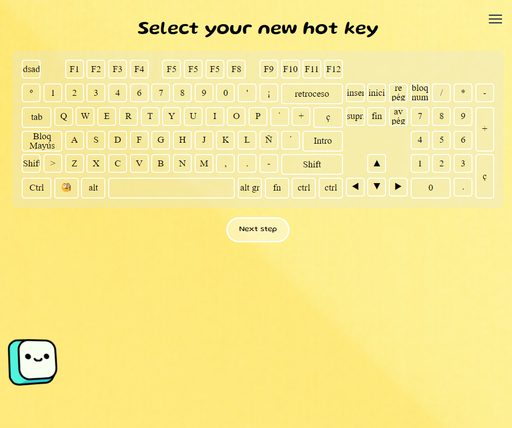

#

What can you do?

- You can create commands that switch to specific windows, and you can also automatically execute keystrokes afterward.

- If you know CSS, you can customize your own keyboard (you can create any keyboard 😏).

- Enable and disable keys.
  

# Developer

Pls see explications folder to see all info about reFocus, currently in process

# Deployment

1º Create binary to backend - Use auto-py-to-exe and import settingToCompile - Press button create exe
2º backend/dist folder was created

3º Front execute command
npm run build:win
