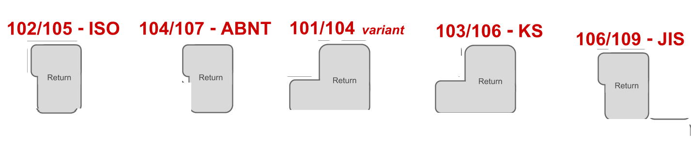

# Example of JSON

```json
{
  {
    "keyboard-id":1,//This is the keyboard id is used to know what keyboard you are using in currentKeyboardLayout
    "keyboard-name":"normal keyboard", //the name of keyboard to identify the keyboard
    "gapsForKeysInWidth": 44, //how much gaps have the keyboard in width
    //Please see how can you calculate this value in the
    "gapsForKeysInHeight": 6,
    "format": [
      //format include keys, gaps withoutKeys, and small space
      {
        //specific if is key,gaps withoutKeys or small space. TO understand this go to First example section of this document
        "type": "key",
        //size of the key can be:
        // - normal: It is  1x1 (width x height)  [1 is equivalent to the space of 1 key]
        // - wide-horizontal: 2*1 (width x height)  [1 is equivalent to the space of 1 key]
        // - wide-vertical: 1*2 (width x height)  [1 is equivalent to the space of 1 key]
        // - square: 2*2  [2 is equivalent to the space of 2 key]
        // - custom: "width/height" as string you have to add how many space you want fill the key for example_
        //            - 1/1: is a normal key
        //            - 1/2: is a wide-vertical
        //            - 1/5: is a space bar
        "size": "normal",
        // the key-type is the class (CSS) of the you can add an JS object with css to personalize de key
        "key-style": "digital-white-Key",

        "key-value": "esc", // Value of the key to identify which key was pressed by the backend (logic of the program). These values are indicated in the IMPORTANT-----> table about equivalents.<-------IMPORTANT

        "key-label": "esc" // They are the characters which will show on key.

        //For example if you config the key with:
        // - "key-value": "esc"
        // - "key-label":"chocobo"
        //You will see a key labeled with the word 'chocobo,' but its internal behavior will function like a normal Esc key.
      },
      {
        "type": "key", //gap without key
        "size": "3/3", //custom size
        "key-style": "darker-3d", //You don't need use the same style to all key. Each key can be UNIQUE
        "key-label": "😏",
        "key-value": "a" //When I press the key with 😏, the system will interpret it as if you pressed the 'a' key.
      }
    ]
  },
  {"keyboard-name":"white keyboard",
    ...
  }
}
```

## How calculate the gapsForKeysInWidth

### First example

For example, when we have a 100% keyboard ([see here](#you-can-see-here-all-types-of-keyboard)). You have to do the next steps:

1. Count the keys of the row with more keys
   - In this case we have three rows with **21** keys
     we choose se 2º row
     
2. You could add to this number the gaps without keys (the gap must be the same size of keys)

   - In this case there is **no** gaps

     **Remenber we are with 2º row**

3. You could add the small space (It is usually the 1/2 of normal key)
   - We have two each small space value: 0.5. Then we have **1**
     
4. You have to add all values of steps 1, 2 and 3

   - 19 (1º step) + 2 (2º step) + 4 (3º steps)= 25

5. Multiply by 2 the value of 4º step
   - 25 x 2 = 50
     If you need to understand this please go to the document about how work keyboard css and key css

### Second example

- Imagine we have this strange keyboard:
  

1. Count the keys of the row with more keys
   - In this case we have one row with **19** keys
     we choose se 1º row
     
2. You could add to this number the gaps without keys (the gap must be the same size of keys)

   - In this case there is **2** gaps
     

3. You could count the small space (It is usually the 1/2 of normal key)
   - We have two each small space value: 0.5. Then we have **4**
     
4. You have to add all values of steps 1, 2 and 3

   - 19 (1º step) + 2 (2º step) + 4 (3º steps)= 25

5. Multiply by 2 the value of 4º step
   - 25 x 2 = 50
     If you need to understand this please go to the document about how work keyboard css and key css

> **🚩🚩Warning🚩🚩:** You don't have to count the gaps without key and the small space. Only there is necessary if you want make the same keyboard. If you don't count any of these, the space between all keys will be the same.

<h1 id="you-can-see-here-all-types-of-keyboard">You can see here all types of keyboard</h1>


# Types of layouts


The keys, which can't be make yet are:


